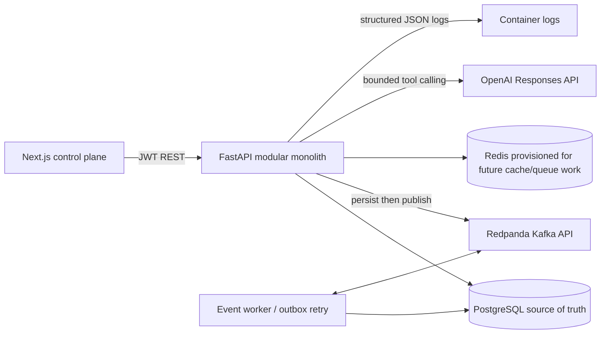

# DataOps AI

DataOps AI is a local data reliability and incident-response control plane. It ingests normalized pipeline, schema, quality, deployment, and connector events; records schema history and lineage; correlates evidence into tenant-scoped incidents; and runs a bounded investigator that can recommend safe next steps.

The project is a modular monolith for V1. Deterministic code owns authorization, schema diffs, quality thresholds, graph traversal, SQL allowlisting, and remediation policy. An OpenAI model can explain evidence and call only bounded read-only tools. Without OpenAI credentials, the application still runs a deterministic demonstration investigation.

## Architecture



The API validates active membership on every authenticated request. It derives organization scope from the signed token and rejects an event whose submitted organization differs from the authenticated tenant. Event IDs are idempotent. The API commits telemetry and normalized state before publishing; the outbox worker retries unpublished rows and consumes external Kafka events.

## Repository layout

```text
apps/api/app/api/          FastAPI routes and authorization dependencies
apps/api/app/models/       SQLAlchemy identity and data reliability models
apps/api/app/services/     Schema, event, incident, quality, lineage, dbt logic
apps/api/app/agents/       Bounded OpenAI investigation and audited tool calls
apps/api/app/policies/     Read-only SQL and remediation policy enforcement
apps/api/app/events/       Kafka publisher, consumer, and persistent outbox retry
apps/api/app/benchmarks/   Ten synthetic evaluation cases and CLI
apps/api/migrations/       Alembic migrations
apps/api/tests/            Unit and API integration tests
apps/web/src/app/          Next.js dashboard and operational pages
docs/                      Architecture, event model, data model, safety, demo
docker-compose.yml
Makefile
.env.example
```

## Local setup

Requirements: Docker Desktop with Compose. Python 3.12 and Node.js 22 are needed only for local test and frontend commands; containers install runtime dependencies.

```bash
cp .env.example .env
# For a shared or deployed environment, replace JWT_SECRET and the seed password.
make up
make migrate
make seed
```

Open [http://localhost:3100](http://localhost:3100). API docs are at [http://localhost:8000/docs](http://localhost:8000/docs); health and database readiness are at `/health` and `/ready`. PostgreSQL and Redis are private to the Compose network. Redpanda's Kafka endpoint is available on `localhost:19092`. Set `WEB_HOST_PORT` if port 3100 is in use.

Seed login: `admin@example.com` / `change-me-now`, organization slug `acme-analytics`. Set `SEED_ADMIN_EMAIL` and `SEED_ADMIN_PASSWORD` before the first seed run to use different credentials. The seeded password is for local development only.

### Skip the sign-in screen locally

For local development you can skip interactive sign-in. Add this to `.env` (or `apps/web/.env.local` when running the frontend outside Docker) and rebuild the web service:

```bash
NEXT_PUBLIC_DEV_AUTO_LOGIN=true
```

With the flag enabled, the control plane signs in automatically using `NEXT_PUBLIC_DEV_EMAIL` / `NEXT_PUBLIC_DEV_PASSWORD` (defaults to the seeded account), pre-fills the sign-in form, and shows a visible `DEV` marker in the sidebar so the state is never ambiguous. Leave the flag `false` — the default — for any shared or deployed environment; it is baked into the web bundle at build time, so `docker compose up --build web` applies a change.

A no-rebuild alternative for a single browser session: sign in once normally, or run the following in the browser console on the workspace origin:

```js
fetch("http://localhost:8000/api/v1/auth/login", {
  method: "POST",
  headers: { "Content-Type": "application/json" },
  body: JSON.stringify({ email: "admin@example.com", password: "change-me-now", organization_slug: "acme-analytics" }),
})
  .then((response) => response.json())
  .then((data) => { sessionStorage.setItem("dataops_token", data.access_token); location.href = "/dashboard"; });
```

Session tokens last 12 hours by default; raise `JWT_ACCESS_TOKEN_MINUTES` in `.env` to extend that.

## Control plane interface

The Next.js control plane is a token-driven design system with light, dark, and system themes, zero runtime UI dependencies, and hand-rolled SVG charting. Every data surface is wrapped in explicit loading, empty, and error states with retry.

- **Command palette** — press `⌘K` (or `/`) to search incidents and datasets, jump between pages, toggle the theme, refresh the current view, or sign out.
- **Keyboard shortcuts** — `G` then `D/I/P/Q/S/L/C` jumps to Overview, Incidents, Pipelines, Quality, Datasets, Lineage, or Connectors.
- **Overview** — severity and pipeline health tiles, incident volume trend, severity mix, quality gauge, schema change watch, fleet status, asset inventory, check runs, and a workspace posture summary. All panels reflect live API data — nothing is mocked.
- **Incidents** — status views, severity filters, environment and date scoping, full-text search, sortable columns, pagination, CSV export, and a detail workspace with investigation, evidence timeline, impact, and audit tabs.
- **Investigation workspace** — root-cause verdict with confidence ring, affected assets, recommended steps, remediation stepper (proposed → validated → approved), expandable tool-call payloads, and an append-only audit feed. Approval requires an admin and never executes production changes.
- **Catalog and lineage** — dataset inspector with schema, version history, and lineage footprint; the lineage explorer renders the server traversal as a layered graph with zoom, auto-fit, node inspection, and click-to-refocus.
- **Quality** — per-check history with anomaly markers, a guided check builder with dynamic configuration and a live JSON preview, and documented semantics for z-score and percentage-change rules.
- **Accessibility** — skip link, focus-visible rings, ARIA roles for tabs/dialogs/menus, keyboard-operable overlays, `prefers-reduced-motion` support, and WCAG-conscious contrast in both themes.
- **Error resilience** — route-level error boundary, styled 404, inline retry affordances, and toast notifications for asynchronous actions.

## Demo walkthrough

```bash
make up
make migrate
make seed
make demo-incident
```

Then sign in and open **Incidents**. The script emits three related events: `raw.orders.customer_id` changes from `BIGINT` to `VARCHAR`; the `transform_orders` run reports the `staging.stg_orders` cast failure; and the `analytics.daily_revenue` freshness check reports stale output. The incident detail page shows evidence, lineage impact, investigation results, tool calls, and remediation controls.

Select **Investigate with AI**. With both `OPENAI_API_KEY` and `OPENAI_MODEL` configured, the investigator uses the configured Responses API model and audited read-only tools. Without them, deterministic demo mode still returns a structured diagnosis and records bounded fixture/database tool calls. Use **Run safe validation** to perform a policy check and dry run. Admins can approve a validated proposal; approval records intent only and does not run SQL, shell commands, or production changes.

The demo also works if Redpanda is temporarily unavailable: telemetry and relational state are committed first, and the outbox worker retries publishing later. The API response includes whether the initial publish succeeded.

## Event and domain flow

`POST /api/v1/events` accepts a validated event envelope and stores it with the tenant, source, environment, timestamp, event type, severity, and bounded payload. The modular event processor updates pipeline runs, deployments, schema history, and incident evidence. The Kafka worker consumes external events idempotently using `event_id`; failed outbound publishes remain eligible for retry.

Schema comparison is deterministic and records added, removed, rename-looking, type, and nullability changes. Breaking changes can open incidents. A breadth-first lineage traversal is cycle-safe and capped at depth 10 and 500 nodes. Quality checks include row count, freshness, null rate, uniqueness, numeric range, and accepted values. Percentage-change and z-score rules are deterministic; incidents can correlate failed pipeline runs and downstream freshness failures with their upstream schema incident.

The `POST /api/v1/dbt/import` endpoint imports dbt models, seeds, snapshots, sources, available columns, descriptions, tags, and dependency edges. The Connectors page supports selecting a manifest file.

## Agent safety and audit

The investigator receives a bounded incident context and uses allowlisted tools for incident evidence, schema history, lineage, pipeline logs, quality history, deployments, and a very narrow aggregate query over demo records. The SQL policy allows only a single aggregate `SELECT` for `COUNT(*)`, `MIN(ingested_at)`, or `MAX(ingested_at)` from `demo_records`; it rejects comments, extra statements, writes, DDL, shell-like content, and other tables. Every tool call records arguments, result, success, and time.

Remediation validation is a dry run. Approval requires an Admin and a validated plan, is audited, and does not execute the plan. The application remains the permission and policy authority; model output cannot approve itself or run arbitrary commands.

## Benchmark

Run `make benchmark` or `cd apps/api && python -m app.benchmarks.run`. The ten fixtures cover schema drift, missing partitions, duplicate ingestion, null spikes, timeouts, broken SQL deployments, stale sources, connector authentication, row explosions, and delayed dashboard freshness. The offline rules baseline reports root-cause category accuracy, affected-asset recall, logical tool calls, and latency. This baseline is a smoke check, not a meaningful model-quality score: it starts from the normalized incident category and the fixture's known lineage.

With `OPENAI_API_KEY` and `OPENAI_MODEL`, `make benchmark` runs the configured model against bounded fixture tools and reports model, token counts when returned, tool calls, and latency. Optional cost estimates require `BENCHMARK_PRICING_JSON`, for example `{"input_usd_per_1m":1.0,"output_usd_per_1m":5.0}`. Rates are supplied by the operator; the code contains no provider pricing assumptions.

## Useful commands

```bash
make up            # Build and start Postgres, Redis, Redpanda, API, web, and event worker
make down          # Stop services; preserves the PostgreSQL volume
make logs          # Follow all service logs
make migrate       # Apply Alembic migrations
make seed          # Load Acme Analytics sample data and checks
make demo-incident # Emit the reproducible schema/pipeline/freshness incident
make test          # Run pytest from apps/api (activate its Python environment first)
make lint          # Run Ruff checks
make format        # Format Python with Ruff
make benchmark     # Evaluate ten synthetic cases
```

The API can also be run locally with Python 3.12: create and activate a virtual environment in `apps/api`, install `.[dev]`, set a reachable `DATABASE_URL`, then run `alembic upgrade head` and `uvicorn app.main:app --reload`. For local frontend work, run `npm ci && npm run dev` in `apps/web`; set `FRONTEND_ORIGIN=http://localhost:3000` in the API environment.

## Known MVP boundaries

The PostgreSQL connector card and quality engine use seeded sample records in the control-plane PostgreSQL database; this is not yet a configurable external warehouse credential/driver integration. Generic webhook events and dbt manifests work. Airflow and Dagster are represented through webhook event adapters. Snowflake and BigQuery are marked as coming soon. Redis is provisioned but not yet used by a runtime path. The demo mode's deterministic investigation and offline benchmark are for local operation and smoke coverage; use the configured OpenAI model to evaluate semantic reasoning. No remediation action executes external production state.

## Documentation

See [docs/architecture.md](docs/architecture.md), [docs/event-model.md](docs/event-model.md), [docs/database-schema.md](docs/database-schema.md), [docs/agent-safety.md](docs/agent-safety.md), and [docs/demo.md](docs/demo.md).
