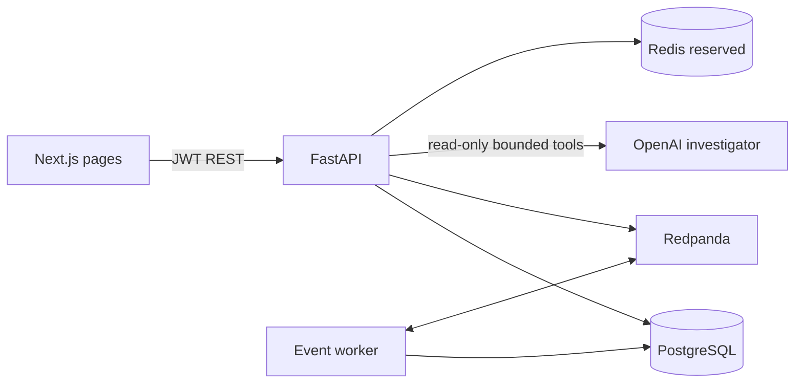

# Architecture

DataOps AI is a modular monolith. Next.js is the authenticated operations UI; FastAPI owns authorization and workflows; PostgreSQL stores identity and domain state; Redpanda transports telemetry; and a companion worker retries the telemetry outbox and consumes Kafka events. Redis runs in Compose as an available cache/queue dependency but is not used by a workflow yet.

Every protected route obtains a `TenantContext` by rechecking the active membership in PostgreSQL. The tenant ID comes from the signed token; query functions scope tenant-owned rows with `organization_id`. Viewer is read-only, Engineer can ingest/investigate/validate, and Admin can approve a remediation proposal.

The event request path validates and commits telemetry plus normalized state before attempting Kafka publication. This keeps the local demo available during broker interruptions. `published_at` and `publish_error` form a small PostgreSQL outbox. A worker retries unpublished events and consumes external messages with Kafka offset commits after database processing. Event IDs make replay idempotent. API-originated messages have already updated local state, so the consumer recognizes and skips their duplicate event IDs.

Services separate schema diffing, dbt import, quality evaluation, lineage traversal, incident evidence compilation, and event processing. The database models cover organizations, users, memberships, environments, connectors, sources, datasets/columns, schema history, pipelines/runs, jobs, quality checks/results, lineage, incidents/evidence, deployments, telemetry, agent runs/tool calls, remediation plans/actions, audit, and demo records.

Structured request logs include request ID, method, path, status, and duration. The current MVP does not export OpenTelemetry spans or metrics; request IDs and workflow IDs are kept available for later tracing integration.

## Local services

Compose starts PostgreSQL 16 with a persistent volume, Redis 7, Redpanda Kafka, the FastAPI app, the event worker, and the Next.js app. PostgreSQL and Redis are not published to the host. The API listens on port 8000, web on port 3100, and Kafka on port 19092 by default.
